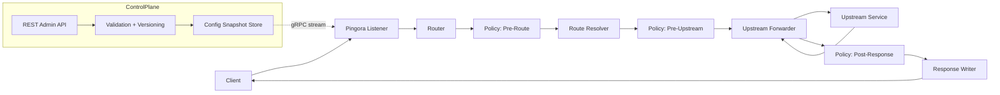

# Architecture

This document outlines the data plane and control plane split, policy stages, and config flow.

**Data + Control Plane Flow**

**Policy Stages**
- Pre-Route: read request line, headers, and context. Can rewrite method/path/query, mutate headers, set routing hints, and short-circuit responses. Body access is disabled.
- Pre-Upstream: access route metadata and upstream selection. Can mutate request headers/body within limits, set upstream options, and short-circuit responses.
- Post-Response: access upstream response headers/body. Can transform or redact response and short-circuit responses.

**Config Flow**
- Bootstrap config is loaded from file + env (Figment) in each service.
- Runtime config is delivered as versioned snapshots over a gRPC stream.
- Data plane applies updates via atomic snapshot swaps.
